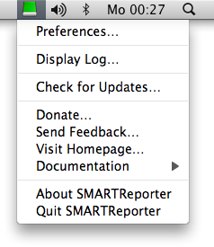
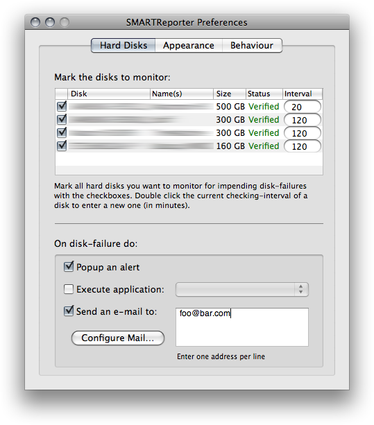
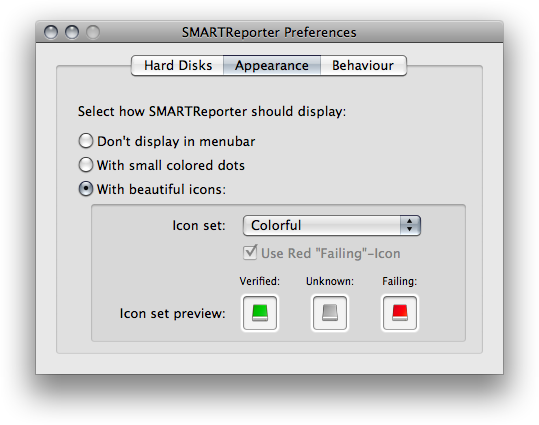
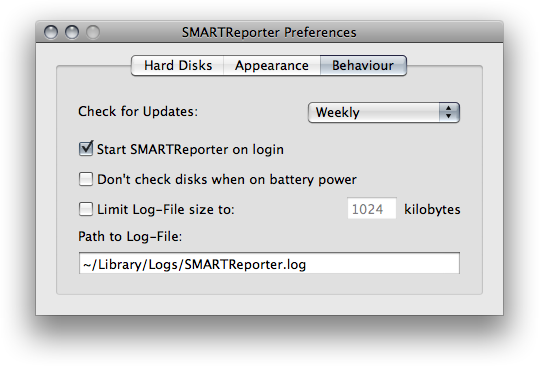
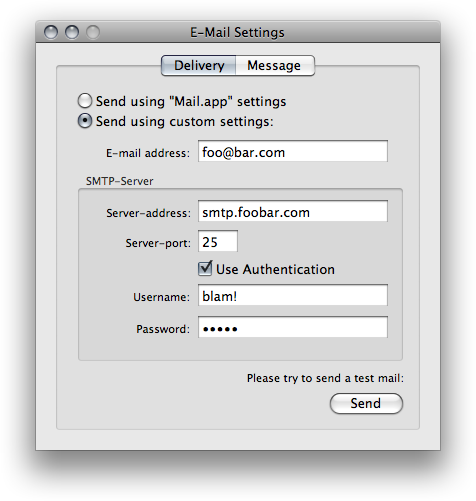
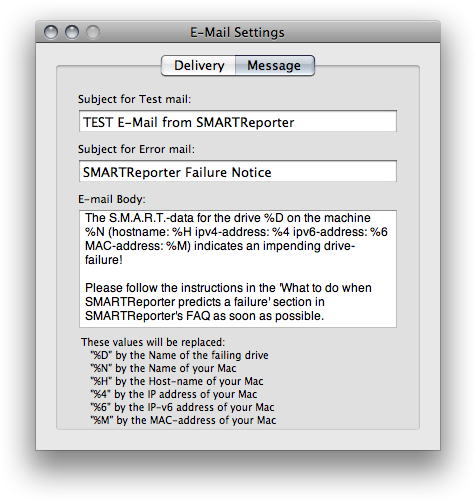

# SMARTReporter
*v2.7.4*

## Introduction:
SMARTReporter is a free application for Mac OS X that can warn you of some hard disk drive failures before they actually happen! It does so by periodically polling the S.M.A.R.T. status of your hard disk drive. S.M.A.R.T. (Self-Monitoring Analysis and Reporting Technology) is a technology built into most modern hard disk drives that acts as an "early warning system" for pending hard disk drive problems. SMARTReporter can notify you of impending hard disk drive failures by sending e-mails, displaying a warning dialog or executing an application. The current status of your hard disk drives is always displayed through the customizable menu item. SMARTReporter also checks for dangerous I/O errors and can monitor the status of software RAID-systems.
Because SMARTReporter relies on the S.M.A.R.T. implementation of Mac OS X, it only supports ATA, SATA or eSATA hard disk drives, if you want S.M.A.R.T. support for your SCSI or FireWire hard disk drive, send [feedback to Apple][1].
Please note that a S.M.A.R.T. alert doesn't mean that your HDD will completely fail for sure, nor can S.M.A.R.T. catch all possible HDD errors - it's just a very valuable indicator. Follow [this link][2] for more information about S.M.A.R.T. technology.

## Requirements:
* Mac OS X 10.5 or later
* At least one ATA, SATA or eSATA hard disk drive

## SMARTReporter 3:
SMARTReporter version 2.x has been discontinued, and is completely unsupported.
Please [upgrade][3] to the completely rewritten version 3 for support and many improvements.

## License &amp; Cost:
SMARTReporter 2 is completely free of charge and the source code is licensed under the [Open Source "MIT License"][4]. 

## Download Binary:
[SMARTReporter Lite 2.7.3 Universal Binary][5]

## Usage:
1. Place the SMARTReporter folder anywhere on your file system (the "/Applications" folder is most suitable).
2. Double-click SMARTReporter.
3. An icon of a hard disk drive should appear in your menu bar (right top of your screen). It turns green when your hard disk drives are verified, turns red when at least one of them is failing, or stays grey if no status has been determined (you can also choose other "styles" in the preferences).
4. The Preferences panel will be opened because this is the first time you use SMARTReporter. If not, click on the icon of SMARTReporter in the menu bar and select the "Preferences…" menu-item.
5. Now a list of all S.M.A.R.T. capable hard disk drives attached to your computer should appear. You can select which ones should be polled for their S.M.A.R.T. status and at which interval. Hard disk drives will be spun-up for their status to be determined. You can also choose how SMARTReporter will notify you of hard disk drive failures, and customize appearance options. There is also an option to auto-start SMARTReporter after login.
6. If you want to see the individial S.M.A.R.T. attribute values or perform a short S.M.A.R.T. self-test on a drive you can do so by right-clicking on a drive in the list and selecting the appropriate item.
7. Close the Preferences panel. SMARTReporter will now alert you (with the actions you've selected as well as by changing it's menu-icon) when it determines any impending problems.

## Screenshots:

[1]: https://www.apple.com/feedback/macos.html
[2]: https://hddlife.com/eng/help/4_How_to/4_2_smart.htm
[3]: https://www.corecode.io/smartreporter/
[4]: https://opensource.org/licenses/mit-license.php
[5]: https://www.corecode.io/downloads/smartreporter_2.7.3.dmg
