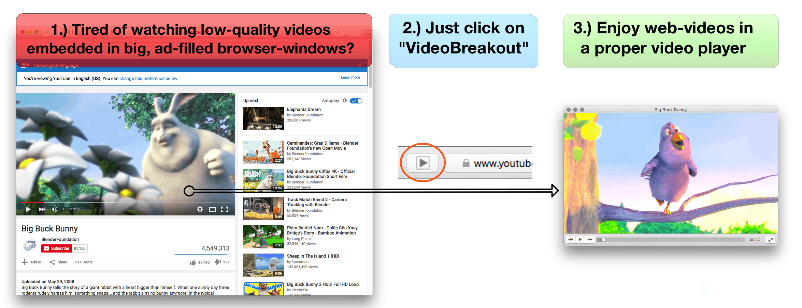

# VideoBreakout
*1.1.0*

## Introduction: 
VideoBreakout allows you to view web-videos in a proper and native video-player instead of having to watch them embedded into a website in your browser. VideoBreakout installs a Safari toolbar plugin you can click whenever you'd rather watch a web-video in a proper video-player (VLC). This allows for higher quality, convenience and more playback options like filters, playback speed, etc.

## Requirements:
* macOS 10.10 'Yosemite' or later
* VLC 2.2 or later

## License & Cost:
VideoBreakout is licensed under a [proprietary license][1] and is currently free of charge.

## Download Binary:
[VideoBreakout 1.1.0 Universal Binary][2]

## Usage:
1. Download VideoBreakout, move it to your Applications folder and launch it.
2. To setup VideoBreakout, you need to install VLC and install the VideoBreakout Safari browser extension - both steps can be initiated from the VideoBreaout app and their status is displayed right away.
3. When you've finished setup and 'VideoBreakout' dispays 'fully operational' you can quit the VideoBreakout app
4. Now anytime you come across a video in a website you'd rather watch with VLC, just click on the 'VideoBreakout' toolbar icon in your Safari toolbar. The 'VideoBreakout' toolbar icon looks like a 'Play' icon. Clicking it will open the video in VLC.
5. If you come across a (website with a) video that can not be opened with 'VideoBreakout', just let us know!

## Screenshots:

[1]: http://www.apple.com/legal/macapps/dev/stdeula/
[2]: https://www.corecode.io/downloads/videobreakout_latest.zip
